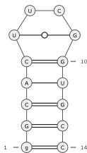
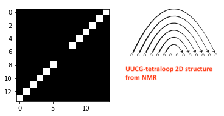
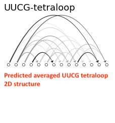
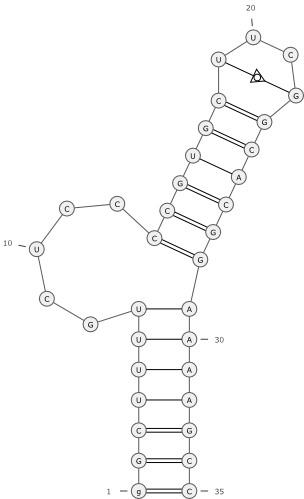
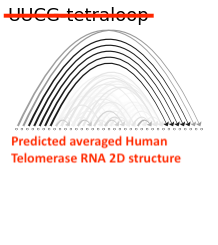

# RNA_Folding_Prediction_Using_Simulated_Annealing

## UUCG-tetraloop 2D structure generated in [RNApdbee](http://rnapdbee.cs.put.poznan.pl/) using PDB data.

## Vusualize UUCG-tetraloop 2D structure as a Line graph

## Averaged UUCG-tetraloop 2D structure predicted by Simulated Annealing

## Human telomerase RNA 2D structure generated in [RNApdbee](http://rnapdbee.cs.put.poznan.pl/) using PDB data.

## Vusualize Human telomerase RNA 2D structure as a Line graph

## Averaged Human telomerase RNA 2D structure predicted by Simulated Annealing

